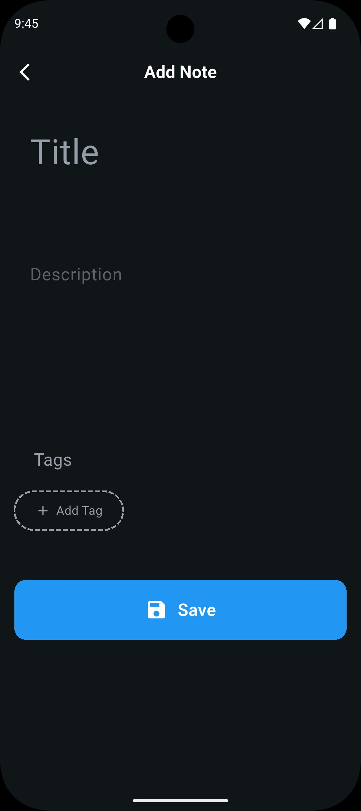
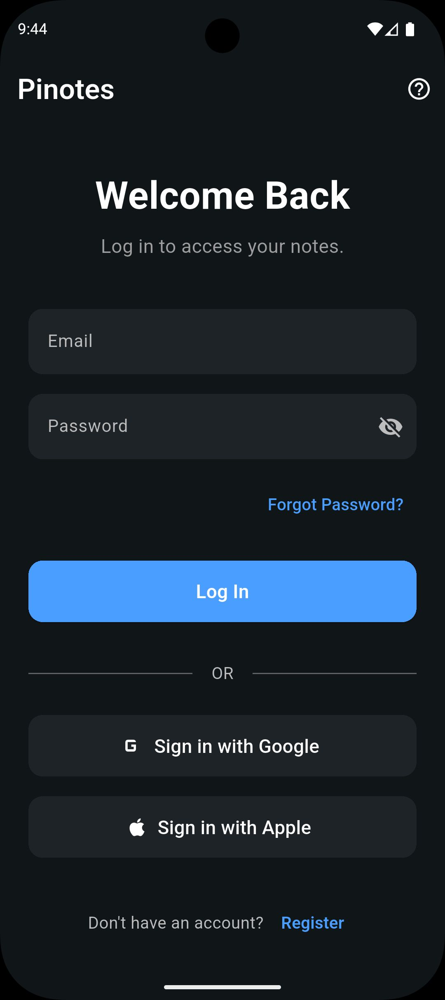
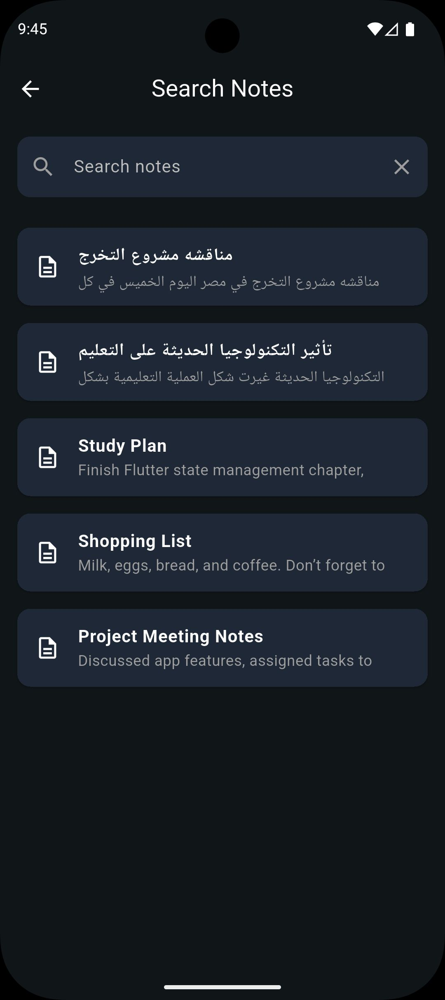
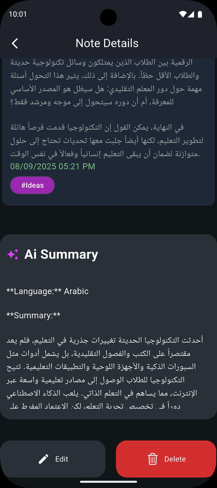

# Note App

A versatile cross-platform note-taking application built using Flutter. This project showcases the implementation of CRUD operations, local data storage, and a user-friendly interface for managing personal notes.

## Features

- Create, read, update, and delete notes using firebase firestore.
- Clean and intuitive user interface.
- Cross-platform support (Android, iOS, etc.).
- authentication using firebase authentication.
- Responsive design for various screen sizes.

## Screenshots

